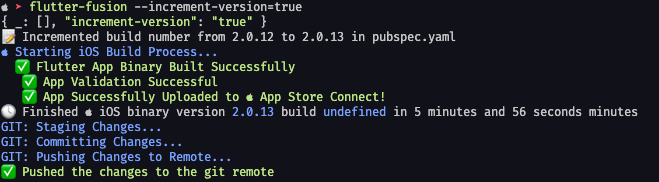
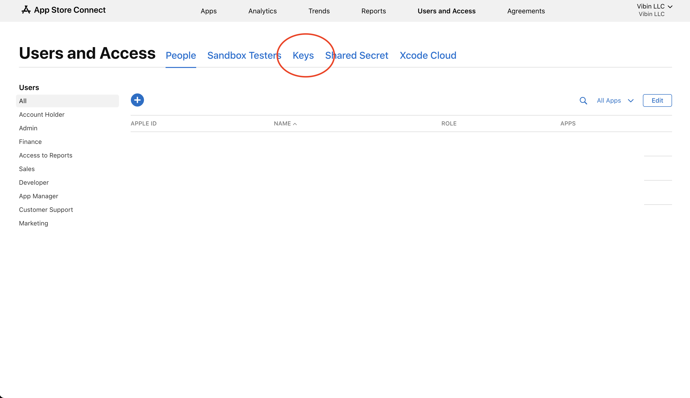
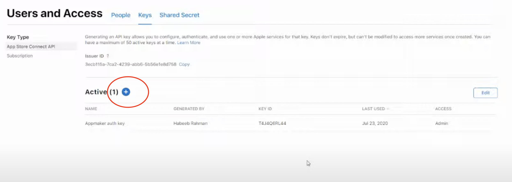
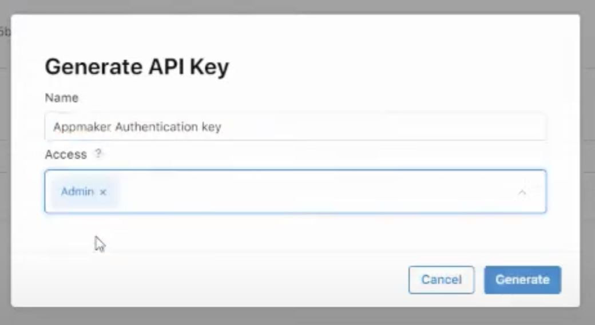
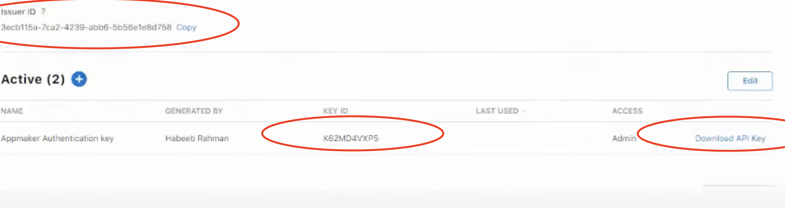

# Flutter Fusion
### The ultimate Flutter build tool


👷 This is still a work in progress. Only building for iOS is support at the moment.

## 💡 Idea
Idk about y'all but I'm tired of manually uploading my builds to App Store Connect and the Play Store. It would be amazing if there is something simple that lets me compile the app on my own computer, manage the versioning, and automatically compile and upload my Flutter app to where ever it needs to be and push to version control. This is where Flutter Fusion comes in!

## Usage
Instead of running flutter build simply run this instead abstracted command in the root of your flutter project

```bash
flutter-fusion
```
Here is an example of how the output will look!
<br />

<br />
This screenshot is a bit outdated, some verbiage has been improved

Optional flags:
- `--git=true|false`: This overrides the default setting in your pubspec to enable or disable committing and pushing to git.
- `--increment-build=true|false`: This overrides the default setting in your pubspec to automatically increment your build number (ex: from 1.0.0+1 --> 1.0.0+2).
- `--increment-version=true`: Increment a whole minor version (ex: from 1.0.0+3 --> 1.0.1+0).

This command alone will automatically build your iOS (Android & Web coming soon) app a proper versioning increment, validate the archives, upload the archives, then auto commit your changes to source control.


## Setup
### Installation
- Install the Deno runtime if you haven't already
  - https://deno.com/manual/getting_started/installation
  - If you are unsure, you can run `deno --version` , if it gives an error when running this command, then you do not have Deno installed
- Install flutter-fusion
```bash
deno install -n flutter-fusion --allow-read --allow-env --allow-run --allow-write --allow-sys --allow-net https://flutter-fusion.sethusenthil.com/main.ts -f
```
`
### iOS and MacOS
Most of this setup will be standard for most build tools and solutions, there is no way around this cumbersome task. However, we are working on a utlity script to make it just a little easier (Still in the works)
- Have Xcode fully installed
- Get your App Store Connect API Key
  - Go to: https://appstoreconnect.apple.com/access/users
    - You will need Admin rights (if it's your account you don't have to worry about this)
  - Navigate to Keys
    - 

  - Create a new key
    - 
    - 
      - Name is whatever you want, does not matter
      - Only the `Developer` permission is required, however you may grant `Admin` as well (as shown in the image)
  - Download the key to your downloads folder
    - 
  - Create a folder in your home directory called `private_keys`
    - `mkdir -p ~/private_keys`
  - Create a new file called pubspec.yaml (sound familiar 😉) in the same  `private_keys` folder
    - `touch -p ~/private_keys/pubspec.yaml && code ~/private_keys/pubspec.yaml`
  - This is where your global settings for Flutter Fusion will be written
  - Paste the following into it and replace it with your information
 ```yaml
  flutter_fusion:
    APP_STORE_CONNECT_API_KEY_ID: "YOUR_API_KEY_ID_HERE" #should be similar to your .p8 file name
    API_KEY_ISSUER: "YOUR_API_KEY_ISSUER_FROM_APPSTORE_CONNECT"
  ```

### General Setup
This is the same for all flutter targets

- In your projects pubspec, simply add the following entry and customize it to your liking. All options can be omitted and it will take its default value, or the value passed in as a flag when running the command.

```yaml
flutter_fusion:
  verbose: false #print all outputs
  #build_flags: ["--no-tree-shake-icons"] #you can pass in additional flags for `flutter build`
  ios: true #enable build and upload for iOS
  android: false #enable build and upload for Android
  web: false #enable build and upload for Web
  auto_increment_build: false #would recommend setting to TRUE. This will automatically increment your build number (can be overridden temporarily using CLI flag)
  git: false #would recommend setting this to TRUE if you use a git repo. This will automatically commit your code with the provided message and push to remote
```

- You can also add these values to your global pubspec located in ~/private_keys/pubspec.yaml file created earlier to use these settings across multiple Flutter projects
  - options ios, android, web, git and auto_increment_build cannot be set globally as they generally change between projects and require unique setup

#### More info on Git
Flutter Fusion will create a file called 'COMMIT_EDITMSG' on first run. In this file you can enter your commit description. It is reset after every build is uploaded correctly. The title of your commit will always be your entire build version.

The idea of this Git practice is so you enter the changes into this file while you are doing while you are doing them, so when you build and push a new version, these changes are automatically tagged onto the commit description in a neat manner